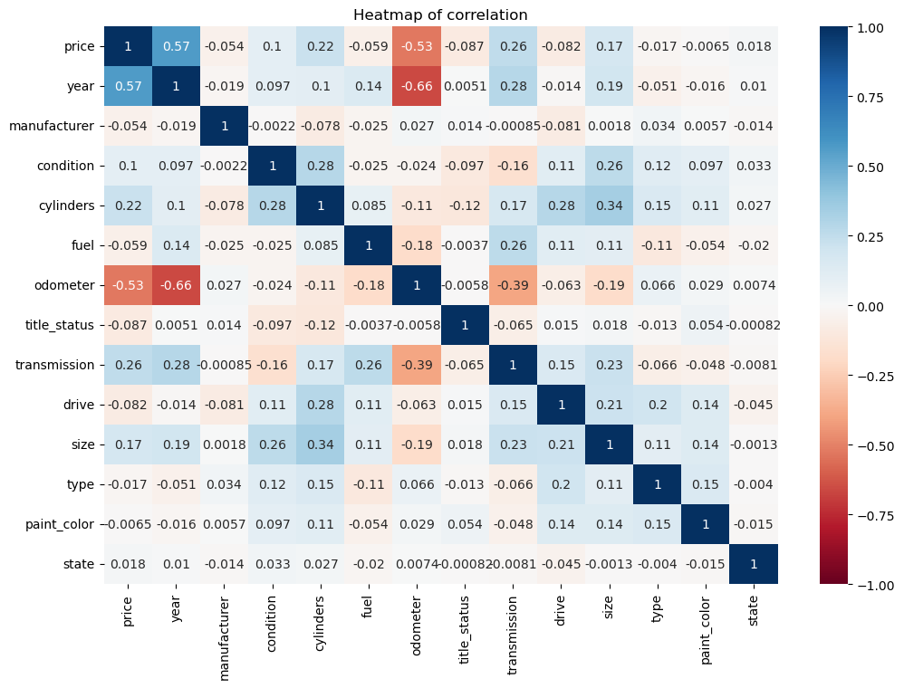

# What-Drives-the-Price-of-a-Car

This is a practical assignment module 11 exploring regressions on used car prices.

# Overview

In this application, I will explore a dataset from kaggle. The original dataset contained information on 3 million used cars. The provided dataset contains information on 426K cars to ensure speed of processing. My goal is to understand what factors make a car more or less expensive. As a result of my analysis, I should provide clear recommendations to your client -- a used car dealership -- as to what consumers value in a used car.

