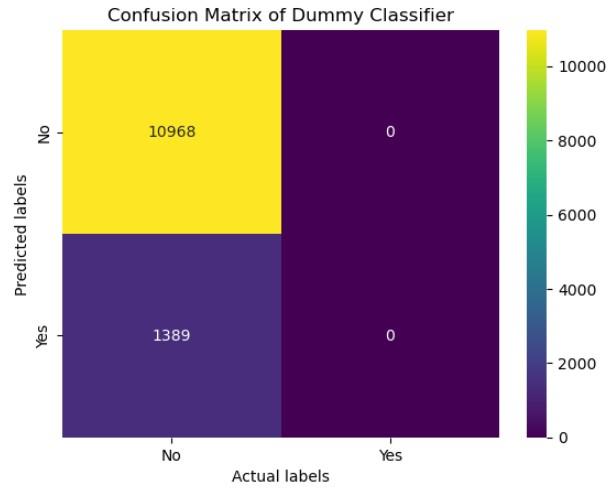

# ComparingClassifiers

Required Assignment 17.1: Comparing Classifiers

Overview: In this practical application, my goal is to compare the performance of the classifiers we encountered in this section, namely K Nearest Neighbor, Logistic Regression, Decision Trees, and Support Vector Machines. I will utilize a dataset related to marketing bank products over the telephone.

# Understanding the Data

The dataset collected is related to 17 campaigns.

# Understanding the Task
This dataset was provided for a Portugese banking as a collection of multiple marketing campaign results.

From a business objective, the task of this Machine Learning project is to determine which factors could lead to a higher success rates to sign up for the long term deposit product.  The analysis of the data shows that the marketing campaign was not very successful in getting customers to sign up for the long term deposit product.

The goal of the project is to compare the performance of the following classifiers:
Logistic Regression
K Nearest Neighbor
Decision Trees
and Support Vector Machines.

10 factors are used a features for the models:

feature_cols = ['job', 'marital', 'education', 'default', 'housing','loan', 'contact','month','day_of_week','poutcome']

X=df[feature_cols]
y=df['deposit']

A Baseline Model
A dummy classifier is used as a Baseline Model.

