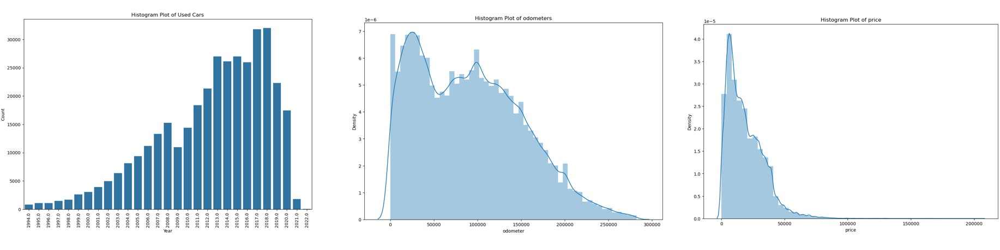
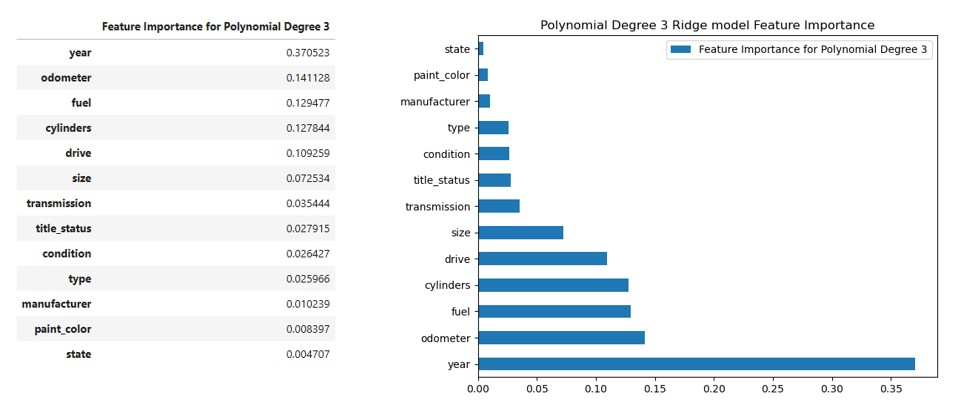

# What-Drives-the-Price-of-a-Car

This is a practical assignment module 11 exploring regressions on used car prices.

# Overview

In this application, I will explore a dataset from kaggle. The original dataset contained information on 3 million used cars. The provided dataset contains information on 426K cars to ensure speed of processing. My goal is to understand what factors make a car more or less expensive. As a result of my analysis, I should provide clear recommendations to your client -- a used car dealership -- as to what consumers value in a used car.

After clean up (filling nulls, removing outliners) and preprocessing, we have got the distribution of non-object factors (Price, year, and odometer) as below:

I used LabelEncoder to convert non-numerical labels into numerical integers then ran the correlation of the factor:

As is shown, the highest correlation involves year, odometer & price.

Other factors which has a correlation with price are transmission, cylinders, size and condition.

# Summary of Polynomial Regression
I did perform Linear regression, degree 2, degree 3, degree 4 and degress 5 Polynomial regression. The testing error (mean_squared_error and mean_absolute_error) is reducing as degree increases. However it takes more time for higher degree Polynomial regression. Degree 4 regression took about 5 mins to finish. Degree 5 regression was unsuccessful after 20 min and aborted with memery error. Therefore, we will focus on degree 3 polynomial for Lasso and Ridge regression.

# Summary of Linear, Lasso, Ridge Regression Comparison:
With the degree 3 Polynomial transformation, we did Linear regression, Lasso regression and Ridge regression. The results are very similar. For this issue, there is no much difference for the three methods.

# Feature Importance of Polynomial Degree 3 Ridge model

# Further discussion
There are limits on this model. From the business point of view, it does not tell the profitability of the car. A car of high value does not necessarily mean high profitability. For the business objective, a profitability model would include the trade-in value, a dealer selling price, turn around period etc. There are area to improve this model. Logarithmic transformation may yield more accurate result for inference tha a polynomial model.
