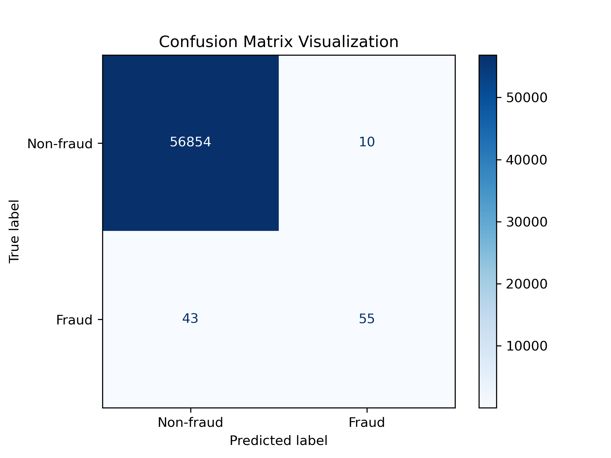

#  CAPSTONE PROJECT: EDA
## Xiaohui Li

This project presents an Exploratory Data Analysis (EDA) and predictive modeling for a final capstone project focused on detecting credit card fraud using advanced machine learning techniques. The dataset used in this study was obtained from Kaggle: https://www.kaggle.com/datasets/mlg-ulb/creditcardfraud
.

The project began with initial data exploration to better understand the dataset, identify patterns, and examine class imbalance. A baseline model using Logistic Regression was then developed to evaluate initial predictive performance before applying more advanced machine learning techniques.

Why this project was chosen

Credit card fraud is a growing global issue with significant financial impact. In 2023, global credit card fraud losses exceeded $34 billion, and projections estimate losses could reach $48.5 billion by 2034. Detecting fraudulent transactions in real time is critical for financial institutions and businesses. Effective fraud detection helps prevent financial losses, improves customer trust, reduces customer churn, and enables organizations to avoid regulatory penalties.

Therefore, this project aims to explore machine learning approaches that can accurately identify fraudulent transactions and contribute to more effective fraud prevention systems.

## Summary of Losgistic Regress Base Model
with a total of 56962 test samples, the matrix shows a highly imbalanced dataset with "0 - non-fraud" class predicted with high accuracy but the "1 - fraud" class is more difficult for the Logistic Regression model to capture.

True Negative (56,864): the modelcorrectly identified majority of the "0 - non-fraud" class.\
True Positive (55): The model correctly identified 55 instances of the target class.\
False Positive (10): the model predicted the target class when it was not there (Type I error).\
False Negative (43): the model missed 43 actual cases of target class(Type II error).

Precision (85%): when the model predicts "positive", it is right for about 85% of times.\
Recall (56%): the model only caught 56% of all actual "Positive" cases.\
F1-score (67%), this is the balance between precision and recall. A score of 0.67 suggests there is room to improve the model's ability to find the minority class without increacing false alarm.

## next steps:
For the final Capstone project, I plan to implement more advanced machine learning models, including Decision Trees, Random Forest, Support Vector Machines (SVM), Neural Networks, Gradient Boosting models, and Anomaly Detection techniques.

To evaluate model performance, I will use multiple metrics, including accuracy, precision, recall, F1-score, and Precision-Recall Area Under the Curve (PR AUC). These evaluation methods are particularly important for credit card fraud detection due to the highly imbalanced nature of the dataset, where fraudulent transactions represent only a small portion of the data.

[Link to the Jupyter Notebook.](https://github.com/xiaohuili-sv/home/blob/UCBerkeleyAIML/Capstone_20_1_EDA/Capstone20_1_EDA.ipynb)
